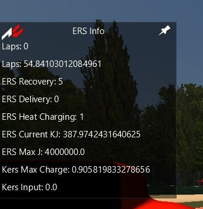

# Assetto Corsa ERS App

> Energy Recovery System app for Assetto Corsa
>
> [App site](https://lucaswander.github.io/Assetto-Corsa-ERS-App/)

 

# Instalation

1. Download the latest [release](https://github.com/LucasWander/Assetto-Corsa-ERS-App/releases).zip
2. Extract the zip content
3. Move the extracted folder to Assetto Corsa root folder. Example:

        C:\Program Files (x86)\Steam\steamapps\common\assettocorsa
4. Enable the app on Assetto Corsa options

 

# Docs and Resources

- [Shared memory for python applications (sim_info.py) for ac >= v0.22](https://www.assettocorsa.net/forum/index.php?threads/shared-memory-for-python-applications-sim_info-py-for-ac-v0-22.11382/)
- [Python Docs](https://www.assettocorsa.net/forum/index.php?threads/python-doc-update-25-05-2017.517/)
- [Shared Memory Reference](https://www.assettocorsa.net/forum/index.php?threads/shared-memory-reference-25-05-2017.3352/)
- [Programming Language - Apps - GUI Themes](https://www.assettocorsa.net/forum/index.php?forums/programming-language-apps-gui-themes.22/)

# TODO

[ ] - Remove laps label
[ ] - Remove energy storage capacity label
[ ] - 3 decimal numbers
